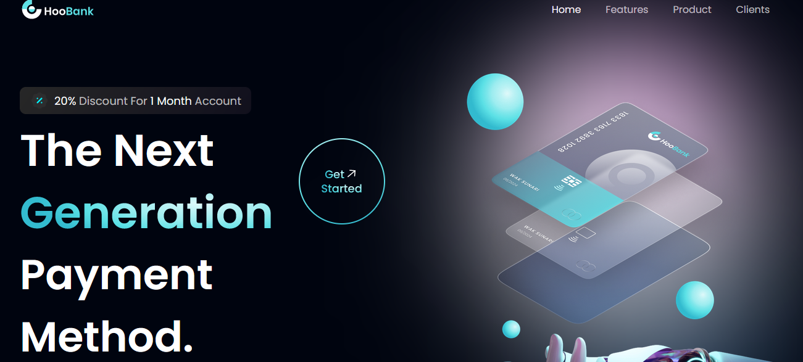
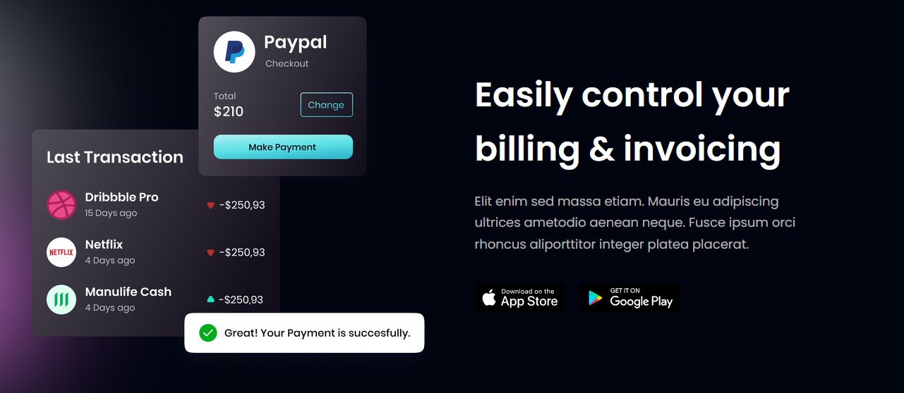
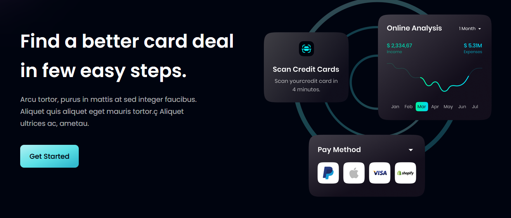

# HooBank - Modern UI/UX website using React.js & Tailwind CSS





## Description
Hoobank it's a sample UI/UX showcase for a site using React and Tailwind CSS.

The site it's build with:
- React(v.18, under Javascript)
- Tailwind(v.3)
- Vite(v.3)

## Building the site
```
"dev": "vite"
"build": "vite build"
```

## Site preview
```
"preview": "vite preview"
```